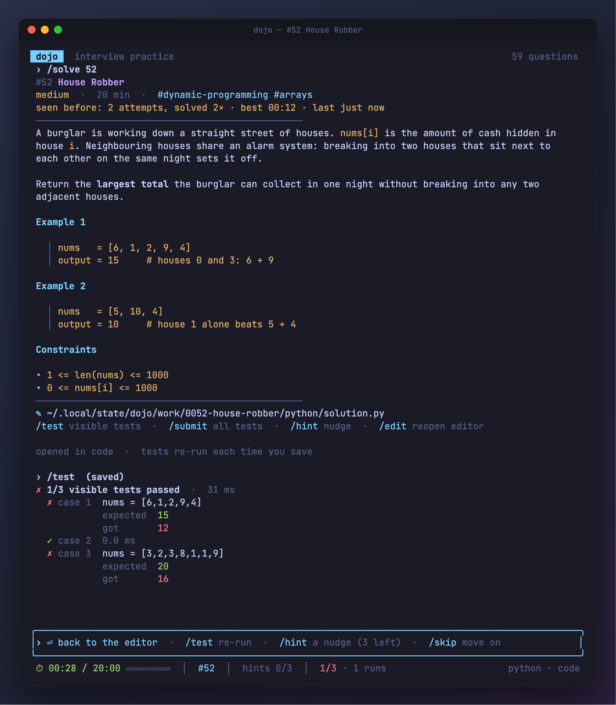
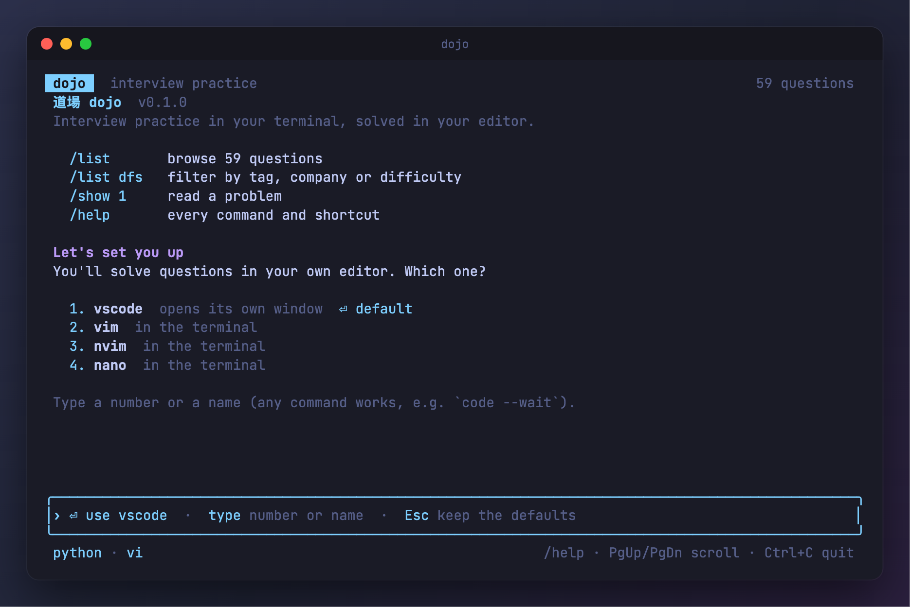
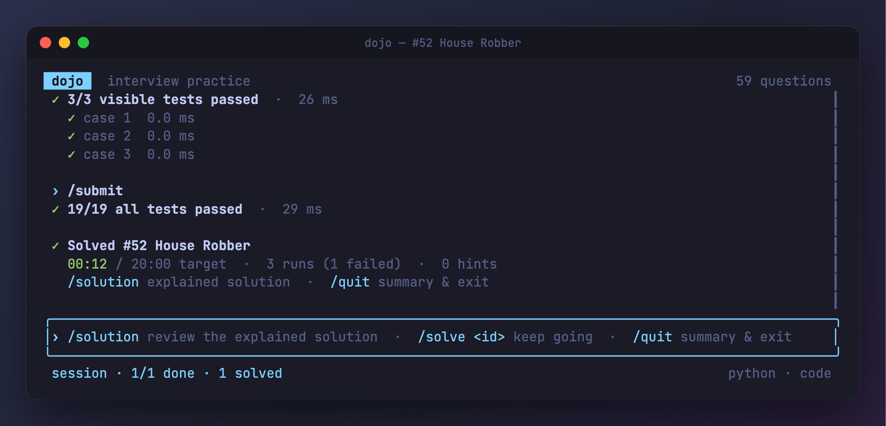
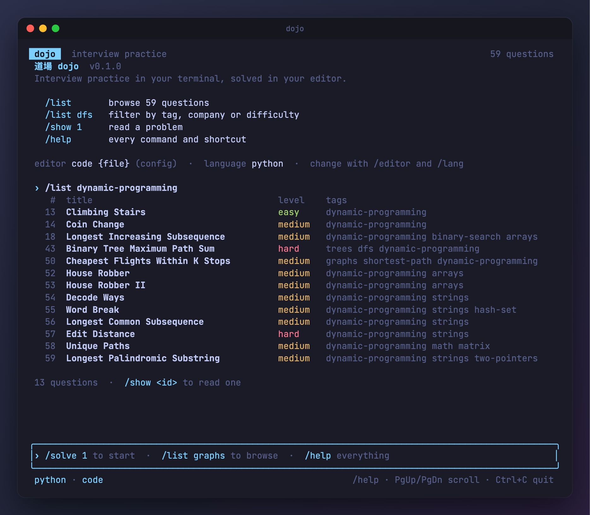
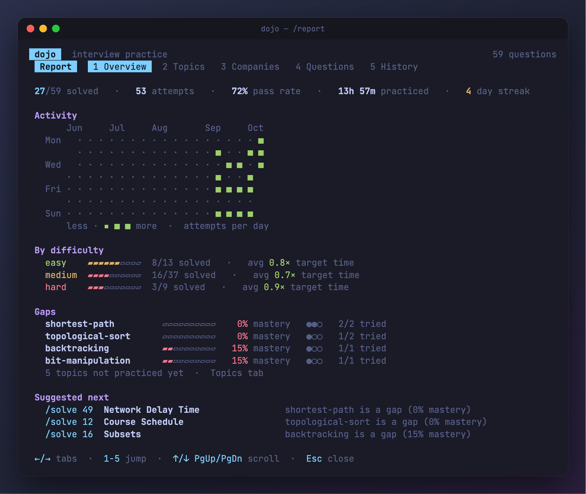
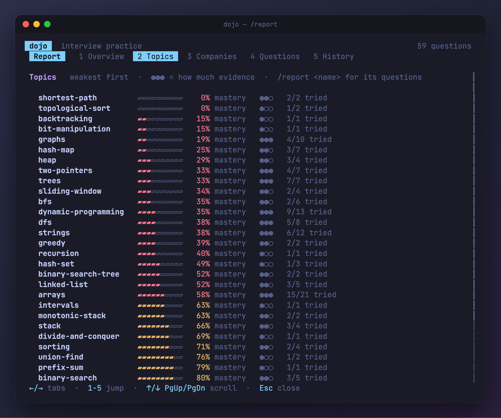

<div align="center">

# 道場 dojo

**Coding-interview practice in your terminal, solved in your own editor.**

Pick a question, write the solution in vim, VS Code or whatever you use, and dojo
re-runs the tests every time you save. It times you and tracks what you've
mastered, then tells you what to practice next.

[](https://github.com/abahocodes/dojo/actions/workflows/ci.yml)


[](LICENSE)
[](https://github.com/sponsors/abahocodes)



</div>

## Why dojo

- **Your editor, your setup.** No browser textarea. dojo opens the question's
  file in your editor and watches it: every save runs the visible tests.
- **Honest practice.** A timer against each question's target time, hints when
  you ask for them, and the explained solution only when you give up. Each of
  those counts toward how well you know the topic.
- **Knows your gaps.** Mastery per topic and per company, weighted toward what
  you did recently, with a suggested next question that targets your weakest
  topic.
- **Offline and private.** One binary and a local SQLite file. No account.
  Nothing leaves your machine unless you use `/contribute`.

## Install

**Homebrew** (macOS and Linux):

```sh
brew install abahocodes/tap/dojo
```

**Install script** (puts `dojo` in `~/.local/bin`):

```sh
curl --proto '=https' --tlsv1.2 -LsSf https://github.com/abahocodes/dojo/releases/latest/download/dojo-installer.sh | sh
```

Prebuilt binaries for macOS (Apple silicon and Intel) and Linux (x86_64 and
arm64) are on the [releases page](https://github.com/abahocodes/dojo/releases).

**From source**, with Rust installed:

```sh
git clone https://github.com/abahocodes/dojo && cd dojo
SQLX_OFFLINE=true cargo install --path .
```

You also need **Python 3.10+** or **Node.js 18+**, whichever you solve in.

## Quick start

```sh
dojo
```

The first launch asks which editor and language you use. It lists the editors
it found on your machine, and Enter takes the default.



Then:

```text
/solve 1          start on question 1 (or a slug, or search words: /solve rotting oranges)
/solve graphs 3   three graph questions in a row
/solve need       the questions that close your biggest gaps
/solve random     surprise me
```

Your editor opens on a fresh file with the function to write. Save, and the
visible tests run. When they pass, `/submit` runs the hidden ones too.



The prompt always shows what makes sense next, and Enter on an empty prompt
does it.

## Browse the bank

Each question has a statement, three hints, an explained solution, and visible
and hidden tests, in Python and JavaScript. Questions are tagged by topic,
company and difficulty, and `/list` filters on any of them.



## See where you stand

`/report` opens a full-screen report: what you've solved, how fast against
target time, your activity, and your weakest topics with a question to fix each.



Every topic is ranked by mastery, along with how much evidence there is
behind it:



How mastery works:
- A pass scores best when it's quick, on the first run and without hints.
- Viewing the solution scores low, and failing or skipping scores zero.
- Recent attempts weigh more; the weight halves every 30 days.

`dojo report --json` prints the same data for scripts.

## Commands

| | |
|---|---|
| **Practice** | |
| `/solve <id \| query \| need \| random> [N]` | start fresh on one or more questions |
| `/test` | run the visible tests (also runs on every save) |
| `/submit` | run every test, including hidden ones |
| `/hint` | reveal the next hint |
| `/solution` | show the explained solution |
| `/edit [id]` | back to the editor, or continue unfinished work |
| `/pause` · `/skip` · `/next` | pause the timer · move on · next question |
| **Browse** | |
| `/list [query \| tag \| company]` | browse questions |
| `/show <id \| slug>` | read a problem statement |
| `/past [id] [n]` | your past attempts and their code |
| `/report [tag \| company]` | mastery, gaps, history and what to practice next |
| **Settings** | |
| `/editor [name \| command]` | show or set your editor (`/editor nvim`, `/editor code --wait`) |
| `/lang [language]` | show or set your language |
| `/config` | settings and file locations |
| **App** | |
| `/contribute` | add a question (see below) |
| `/copy` | copy the last output |
| `/donate` | support dojo |
| `/help [command]` · `/quit` | everything · close dojo |

Some behavior to know:
- **Unfinished work.** Quitting mid-question keeps it: the timer pauses and
  `/edit` picks it up next time.
- **Stepping away.** The timer pauses itself after 15 minutes with nothing
  happening, and that time isn't counted. Change it with `idle_pause_minutes`;
  0 turns it off.
- **Reviewing on `/quit`.** If questions went unsolved, `/quit` offers their
  explained solutions before you leave.

## Contribute a question

Describe a question in plain words and dojo drafts all of it: the statement,
hints, explained solution, tests, and starter code and a reference solution in
every language. It then validates the draft by running everything locally.
Review the result, ask for changes in your own words, and `/accept` opens the
pull request for you, using `gh`, which dojo can install and sign you in to.

```text
/contribute ollama    free, runs a local model (dojo can install Ollama for you)
/contribute claude    Anthropic API key
/contribute openai    OpenAI API key
```

API keys are kept in your OS keychain, never in files. Questions can also be
written by hand: [`questions/README.md`](questions/README.md) has the format,
and `dojo validate` checks it.

Every question PR is checked in CI:
- its files against the [JSON Schemas](schema/)
- its reference solutions pass every test in every language, quickly and with
  the same results every time
- its starter code loads but doesn't pass

## Configuration

`~/.config/dojo/config.toml` (or `$XDG_CONFIG_HOME/dojo/config.toml`):

```toml
editor = "nvim {file}"       # {file} and {dir} are filled in; falls back to $VISUAL, then $EDITOR
language = "python"          # or "javascript"
auto_test = true             # run visible tests on every save
idle_pause_minutes = 15      # 0 turns it off
# workspace = "/path/to/practice"   # where solution files live
```

Your history is a SQLite database in `~/.local/share/dojo/`. Set `DOJO_HOME`
to keep everything in one directory.

## Development

```sh
SQLX_OFFLINE=true cargo test                            # dojo's tests: runner per language, app, model
SQLX_OFFLINE=true cargo test --features question-tests  # also every question in the bank
cargo run -- validate                                   # check the bank
```

SQL is checked at compile time against `.sqlx/`. After changing a query, run
`scripts/dev-db.sh --prepare`. To cut a release, push a version tag: `v0.2.0`
builds the binaries, the install script and the Homebrew formula.

## Support

dojo is free and open source. If it helps you land the job, consider
[sponsoring its development](https://github.com/sponsors/abahocodes) (or run `/donate`).

## License

[MIT](LICENSE)
